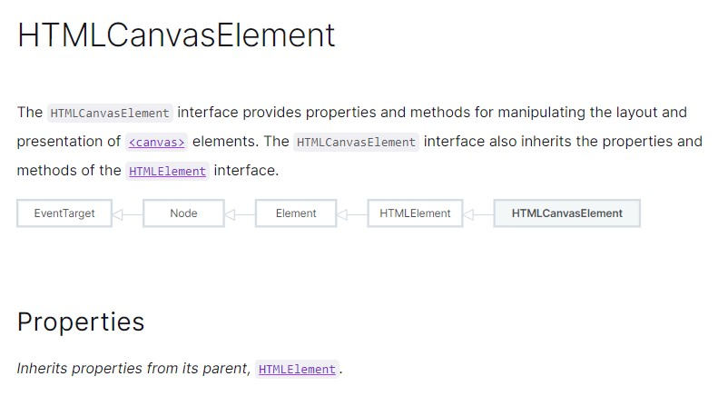

# Wstęp do elementu canvas

## jak czytać dokumentację WebAPI

Naszym głównym źródłem wiedzy jest [MDN](https://developer.mozilla.org/), niestety większość materiałów jest tam po angielsku.

Są dwa rodzaje materiałów 

* Refrence - to jest klasyczna dokumentacja ze szczegółowym opisem narzędzi do naszej dyspozycji
* Guide - to są krótkie kursy jak kożystać z onych narzędzi.

Zazwyczaj nalepiej zobaczyć po pierwsze kurs (Guide) i gopiero kiedy nie będzie w nim odpowiedzi przejść do klasycznej dokumentacji (Refrence)

Są cztery kategorie treści
* CSS - jak pisać style CSS
* HTML - jak pisać dokumenty HTML
* JS - opis samego języka javascript, który jest w CtJS, przeglądarce, NodeJS i wielu innych miejscach
* WebAPI - opis API przeglądarki, czyli obiektów które pozwalają używać skryptów na stronie internetowej. Będą tu opisane zarówno obiekty document i window, jak i obiekty do obsługi elementów strony takich jak Canvas czy zdarzenia (Eventy) 

W tej lekcji będziemy korzystać głównie z kursu i dokumentacji do WebAPI.

### Interface i dziedziczenie

Korzystając z dokumentacji możemy trafić na podobny obrazek:

Oznacza on tylko tyle, że nasz obiekt jest bardziej rozbudowaną wersją innego, prostszego obiektu.

Np. HTMLCanvasElement umie wszystko to co podstawowe elementy (HTMLElement) ale ma też własne specjalne zdolności opisane na tej stronie. Podstawowe rzeczy nie są powtórzone ale możemy się ich dowiedzieć w dokumentacji obiektu HTMLElement.

## element canvas

Nas interesują głównie 3 rzeczy:

width i height oraz getContext('2d')

With i height to szerokość i wysokość płótna do rysowania. Żeby nasz obrazek wyglądał estetycznie, chcemy żeby wymiary płótna były równe wymiarom wlwmentu canvas. Dzięki temu obraz będzie ostry.

`getContext("nazwa_kontekstu")` pozwala nam pobrać kontekst do rysowania, czyli zestaw narzędzi. 

Mamy do wyboru róże konteksty bo nadają się do różnych zadań, do prostych rysunków 2d, najłatwiej użyć kontkestu `2d`.

W ramach ciekawostki, dostępne aktualnie opcje to:

* `2d` - kontekst do prostych rysnkó 2d
* `webgl`- kontekst do rysowania w 3d z pomocą OpenGL ES 2.0
* `webgl2` - kontekst do rysowania w 3d z pomocą OpenGL ES 3.0
* `bitmaprenderer` - kontekst do rysowania obrazków zapisanych w zmiennej, np pobranych z internetu w niestandardowy sposób